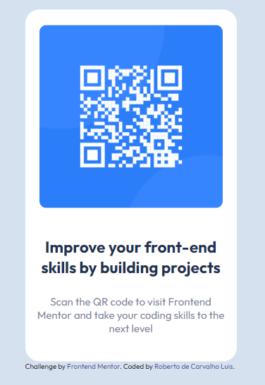

# Desafio do Frontend Mentor QR code.
 
Projeto que continha a finalidade de centralizar um container com o QR code do Frontend Mentor, um projeto simples com objetivo claro porém foi de extrema importância para mim neste momento de aprendizado para fixar e práticar o conteúdo.
  

 

## Tecnologias utilizadas
<ul>
    <li>HTML</li>
    <li>CSS</li>
</ul>
